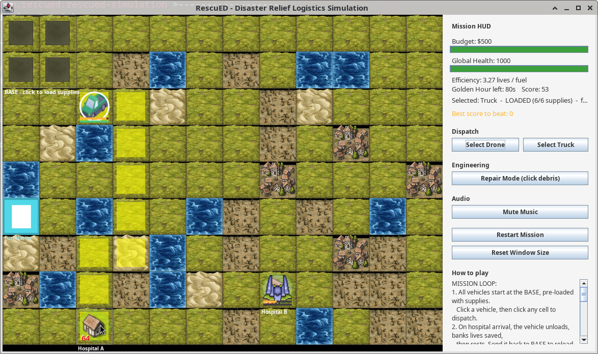

# RescuED

> A real-time disaster-relief logistics simulation built in Java Swing.
> Dispatch drones and trucks across a randomly-generated flooded city,
> repair debris, refuel at fuel stations, beat your high score.


[](../../actions)
[](../../releases/latest)

> ⚠️ **Beta release (`v0.1.0-beta`).** This is an early work-in-progress:
> gameplay is playable and balanced, but expect rough edges, balance
> changes, and breaking changes before `1.0.0`. Bug reports and feature
> requests are very welcome — see [Contributing](#contributing).

---

<p align="center">
  
</p>

---

## Table of Contents

- [Overview](#overview)
- [Features](#features)
- [Quick Start](#quick-start)
- [Gameplay](#gameplay)
- [Controls](#controls)
- [HUD Reference](#hud-reference)
- [Project Structure](#project-structure)
- [Architecture](#architecture)
- [OOP Design](#oop-design)
- [How to Build and Run](#how-to-build-and-run)
- [Configuration](#configuration)
- [Troubleshooting](#troubleshooting)
- [Documentation](#documentation)
- [Roadmap](#roadmap)
- [Contributing](#contributing)
- [Changelog](#changelog)
- [License](#license)
- [Acknowledgments](#acknowledgments)
- [Author](#author)

---

## Overview

RescuED is a single-player real-time strategy game where you take command of a small fleet of rescue vehicles responding to a natural disaster. You have **90 seconds** (the "Golden Hour") to deliver supplies to 2–5 hospitals before their escalating needs overwhelm the city's Global Health.

- **Trucks** are powerful but cannot cross floods or debris.
- **Drones** fly over absolutely everything — even buildings — but carry much less fuel.
- **Fuel stations** scattered across the map let you extend your range.
- **Repair Mode** turns debris back into roads at $40 per tile.
- **Emergency spikes** appear randomly on hospitals — reach them in time for a 1.5× bonus, or lose global health.

The map is procedurally generated every mission (with an optional fixed seed for reproducible test runs), and a reachability guarantee ensures every map is winnable with a Truck using only your starting repair budget.

---

## Features

### Gameplay
- Real-time simulation running on a Swing `Timer` game loop
- 2–5 randomly-spawned hospitals each mission, scattered across the map
- One vehicle per hospital, alternating Truck / Drone
- All vehicles start pre-loaded with supplies — dispatch immediately
- 2×2 base zone in the top-left of the map (multi-cell supply depot)
- 1–3 fuel stations with on-screen labels, drive-over refuel ($15 per visit)
- Random extra debris in the 3×3 neighborhood of every hospital
- Emergency spike mechanic — every ~15 s, a hospital flashes red; reach it in time for a 1.5× bonus
- Vehicle exhaustion — a vehicle that just delivered must rest for ~2.4 s
- Persistent best score saved to `~/.rescued/highscore.txt`

### Map Generation
- Procedurally-generated random maps (a fixed seed can also be supplied for reproducible test runs)
- **Repair-budget reachability guarantee** — the map is rerolled up to 30 times until every hospital is reachable by a Truck using at most your starting budget in debris repairs; flood-isolated hospitals are rejected outright

### Pathfinding
- Dijkstra-based pathfinding that automatically picks the cheapest valid route per vehicle
- Vehicles can refuse orders when exhausted or mid-route (graceful error feedback)
- Click any cell while a vehicle is selected to dispatch — including the Base and fuel stations

### UI / UX
- **Stretchable UI** — drag the window edges and the grid scales to fit (cells range from 36 px to whatever the screen allows)
- "Reset Window Size" button to restore the default window size
- Mission HUD with budget + health progress bars, color-coded by severity
- Mouse hover highlight on the cell under the cursor
- Per-vehicle fuel bar (orange) and supply bar (green)
- Status halos around hospitals (green / yellow / orange / red)
- Exhausted-vehicle translucent overlay
- Hospital name labels below each tile

### Technical
- Two vehicle classes with polymorphic movement rules (Drone vs Truck)
- Exponential hospital urgency that escalates over time
- Repair Mode for clearing debris tiles (costs budget)
- Mission stats: budget, lives saved, fuel spent, efficiency, mission score, golden-hour countdown
- Background music loop and one-shot sound effects
- Automatic fallback when asset files are missing (silent continue with shape-based drawing)
- Mouse hover feedback and live HUD refresh on every game tick
- **Zero third-party dependencies** — everything builds with only the JDK

---

## Quick Start

```bash
# Clone and enter the repo
git clone https://github.com/harisahmed05/RescuED.git
cd RescuED

# Build and run with Maven
mvn compile exec:java

# Or, with no Maven at all:
mkdir -p build
javac -d build src/main/java/com/rescued/simulation/*.java
cp -r src/main/resources build/
java -cp build com.rescued.simulation.Main
```

That's it — no `npm install`, no Gradle wrapper, no Docker. See [How to Build and Run](#how-to-build-and-run) for IDE instructions and troubleshooting.

---

## Gameplay

### Mission Stats

The mission starts with:

| Resource | Starting Value |
|---|---|
| Budget | $500 |
| Global Health | 1000 |
| Hospitals | 2–5 random (each starting at 30–49 need) |
| Vehicles | One per hospital: alternating Truck / Drone |
| Fuel stations | 1–3 random |

### The Delivery Cycle

Vehicles can no longer just "drive to a hospital and stay there". Every mission follows a continuous cycle:

1. An **EMPTY** vehicle must first travel to the **Base** (a 2×2 zone in the top-left of the map). Arriving on any base cell automatically loads it with supplies and flips it to **LOADED**.
2. A **LOADED** vehicle is dispatched to a hospital. On arrival it unloads its supplies, banks the current need as lives saved, and enters an **EXHAUSTED** state for ~2.4 seconds.
3. Once rested, the vehicle is **EMPTY** again — it must travel back to the Base to pick up more supplies, then head out to another hospital (or the same one).

This means the player is constantly juggling supply runs, vehicle rest cycles, hospital priorities, and emergency spikes — there's no "park at the destination" win state.

### Hospital Urgency

Hospital "need" grows by 15 % every ~3 seconds. If a hospital's need exceeds 150, the city's Global Health starts draining. The mission ends when the Golden Hour timer expires or Global Health hits zero.

### Emergency Spikes

Every ~15 seconds a random non-active hospital triggers an emergency spike: its need jumps to 2.5× and it flashes red with a ~12-second countdown. Reach it before the countdown ends for a 1.5× lives-saved bonus, or take 60 global-health damage.

### Win Condition

There is no single win screen — the goal is to maximize **lives saved per unit of fuel spent** (the "Efficiency" metric) and the composite **Mission Score** before the timer runs out.

For the deeper mechanics, see [`docs/GAMEPLAY.md`](docs/GAMEPLAY.md).

---

## Controls

| Action | How |
|---|---|
| Select a vehicle | Click on it, or use the **Dispatch** buttons in the sidebar |
| Load supplies | Click the **Base** (top-left) with an EMPTY vehicle selected |
| Dispatch to a cell | Click any cell on the map with a vehicle selected |
| Drive over a fuel station | Click the **Fuel Station** tile — refuels for $15 |
| Clear a debris tile | Toggle **Repair Mode**, then click a debris tile (costs $40) |
| Toggle music | Click the **Mute Music** toggle in the sidebar |
| Restart the mission | Click **Restart Mission** |
| Resize the window | Drag any window edge — the grid scales to fit |
| Reset window size | Click **Reset Window Size** in the sidebar |

---

## HUD Reference

The right-hand sidebar shows mission status at a glance.

| Element | Meaning |
|---|---|
| **Budget** ($) | Repair and refuel currency. Starts at $500. |
| **Global Health** | City-wide well-being. Drains when hospital need exceeds 150 or a spike expires undelivered. |
| **Efficiency** | Lives saved per unit of fuel spent. |
| **Golden Hour left** | Seconds remaining before the mission ends. |
| **Mission Score** | Composite score: `livesSaved − (fuelSpent / 10)`. |
| **Selected** | Name, load state (EMPTY / LOADED / EXHAUSTED), fuel and supplies of the currently selected vehicle. |
| **Best score to beat** | Persistent high score from `~/.rescued/highscore.txt`. |

Progress bars under Budget and Health change color (green / yellow / red) based on severity.

---

## Project Structure

```
RescuED/
├── pom.xml                          # Maven build configuration
├── LICENSE                          # MIT License
├── README.md                        # This file
├── CHANGELOG.md                     # Version history
├── CONTRIBUTING.md                  # How to contribute
├── .gitignore                       # Git ignore rules
├── docs/
│   ├── ARCHITECTURE.md              # Codebase tour for contributors
│   └── GAMEPLAY.md                  # Deeper mechanics guide
└── src/
    └── main/
        ├── java/
        │   └── com/rescued/simulation/
        │       ├── Main.java          # Entry point
        │       ├── GameFrame.java     # Main window + sidebar UI
        │       ├── GamePanel.java     # Game grid + game loop
        │       ├── Grid.java          # Map generation + neighbour lookup
        │       ├── Cell.java          # One map tile
        │       ├── TerrainType.java   # Terrain costs/colors (Road, Mud, Flood, Debris, Building, FuelStation)
        │       ├── Vehicle.java       # Abstract base class
        │       ├── Drone.java         # Flies over everything, small fuel + supplies
        │       ├── Truck.java         # Pays full terrain cost, big fuel + supplies
        │       ├── Hospital.java      # Random spawn, growing "relief need", emergency spikes
        │       ├── GameState.java     # Budget / global health / efficiency / mission score
        │       ├── HighScore.java     # Persistent best score at ~/.rescued/
        │       ├── Pathfinder.java    # Dijkstra's algorithm using PriorityQueue
        │       ├── Assets.java        # Loads/caches images
        │       └── Sounds.java        # Plays WAV files (music + effects)
        └── resources/
            ├── images/                # PNG tile and unit artwork
            └── sounds/                # WAV music and effects
```

---

## Architecture

The codebase is small enough to fit in your head. The high-level shape:

- **`Main`** schedules the window construction on the Swing EDT.
- **`GameFrame`** owns the sidebar UI and one **`GamePanel`**.
- **`GamePanel`** owns the game loop (a `javax.swing.Timer` firing every 150 ms), renders the grid, handles mouse input, and advances vehicles along their paths.
- **`Grid`** holds the immutable-size 2D array of **`Cell`**s and provides reachability checks (`shortestTruckReachablePath`).
- **`Vehicle`** (abstract) → **`Drone`** / **`Truck`** is the polymorphic hierarchy. **`Pathfinder.findPath`** calls `vehicle.canEnter(cell)` and `vehicle.moveCost(cell)` without caring which subclass it's holding.
- **`Hospital`** tracks its own growing need and emergency spike state.
- **`GameState`** encapsulates every mission-wide number; **`HighScore`** persists the best score to disk.

For a full tour including thread-safety rationale, why we use `javax.swing.Timer` over `ScheduledExecutorService`, and why the reachability check is a custom BFS instead of `Pathfinder.findPath`, see [`docs/ARCHITECTURE.md`](docs/ARCHITECTURE.md).

---

## OOP Design

The project leans on all four OOP pillars.

### Inheritance

`Vehicle` (abstract) → `Drone`, `Truck`. Adding a new vehicle type (e.g. `Helicopter`) only requires extending `Vehicle` and implementing `canEnter` / `moveCost`.

### Encapsulation

All mutable fields in `Vehicle` and `GameState` are `private`. Outside code interacts only through getter / setter methods.

### Polymorphism

`Pathfinder.findPath()` calls `vehicle.canEnter(cell)` and `vehicle.moveCost(cell)` without caring whether the vehicle is a Drone or a Truck. The exact same pathfinding algorithm produces different routes for different vehicle types automatically.

### Abstraction

`Vehicle` defines the contract every concrete rescue unit must satisfy. The pathfinder and rendering code only ever speak to the abstract `Vehicle` interface.

---

## How to Build and Run

### Prerequisites

- **Java 11 or newer** (any JDK; OpenJDK works)
- **Maven 3.6+** *(only required if building with Maven)*

No other dependencies. The game uses only the JDK standard library.

### Option 1: Maven (recommended)

From the project root:

```bash
# Compile and run
mvn compile exec:java

# Or package into a runnable JAR
mvn clean package
java -jar target/rescued-simulation-0.1.0-beta.jar
```

The `exec-maven-plugin` is preconfigured to run `com.rescued.simulation.Main`.

### Option 2: Plain `javac` (no Maven required)

From the project root:

```bash
# 1. Compile all .java files into ./build
mkdir -p build
javac -d build src/main/java/com/rescued/simulation/*.java

# 2. Copy resources next to the compiled classes
cp -r src/main/resources build/

# 3. Run
java -cp build com.rescued.simulation.Main
```

On Windows (PowerShell):

```powershell
mkdir build
javac -d build src\main\java\com\rescued\simulation\*.java
Copy-Item -Recurse src\main\resources build\
java -cp build com.rescued.simulation.Main
```

### Option 3: IDE

Open the project folder in IntelliJ IDEA, Eclipse, or VS Code (with the Java Extension Pack). Right-click `Main.java` → **Run**. The IDE will pick up `src/main/java` and `src/main/resources` automatically.

### Running on a headless server

The game requires a display. On a headless Linux box, use Xvfb:

```bash
xvfb-run -a --server-args="-screen 0 1280x800x24" java -cp build com.rescued.simulation.Main
```

---

## Configuration

All gameplay constants live in [`GameState.java`](src/main/java/com/rescued/simulation/GameState.java). Common tweaks:

| Constant | Default | Meaning |
|---|---|---|
| `STARTING_BUDGET` | `500` | Money for repairs and refuels. |
| `STARTING_HEALTH` | `1000` | Global health at mission start. |
| `MIN_HOSPITALS` / `MAX_HOSPITALS` | `2` / `5` | Range of hospitals per mission. |
| `MIN_FUEL_STATIONS` / `MAX_FUEL_STATIONS` | `1` / `3` | Range of fuel stations per mission. |
| `REPAIR_COST` | `40` | Cost to clear one debris tile. |
| `FUEL_STATION_COST` | `15` | Cost to refuel at a fuel station. |
| `SPIKE_INTERVAL_TICKS` | `100` | Ticks between emergency spike events (~15 s). |
| `VEHICLE_REST_TICKS` | `16` | Ticks a vehicle rests after delivery (~2.4 s). |
| `GOLDEN_HOUR_TICKS` | `600` | Total mission length in ticks (~90 s). |
| `MAX_REGEN_ATTEMPTS` | `30` | Max map rerolls before accepting the best fallback. |

To change the cell size, edit `GamePanel.CELL_SIZE` (default 72 px).

To use a fixed map seed for reproducible testing, edit `GamePanel.newGame()` and replace `new Grid(ROWS, COLS)` with `new Grid(ROWS, COLS, 42L)`.

---

## Troubleshooting

### "No sound?" 
Make sure your system audio is on. The game prints `[Sounds] Missing sounds/...` to the console if a file is missing and continues silently. The game is fully playable without audio.

### "Missing art?"
The game falls back to plain colored shapes and prints `[Assets] Missing images/...` to the console. Gameplay is unaffected.

### "Window too small / too big?"
The window is resizable — drag any edge. Use the **Reset Window Size** button in the sidebar to restore the default. Cells range from 36 px minimum to whatever the screen allows.

### "Game won't launch / `ClassNotFoundException: com.rescued.simulation.Main`"
Make sure you're running from the directory that contains the `com/` package subdirectory. If using Maven, `mvn compile exec:java` should handle this for you.

### "Compilation error: cannot find symbol `com.rescued.simulation.*`"
You're probably running the wrong command. Use either `mvn compile` (from the project root) or `javac -d build src/main/java/com/rescued/simulation/*.java` — the source files are in `src/main/java/com/rescued/simulation/`, not at the project root.

### "High score file can't be written"
The game prints `[HighScore] Could not persist high score: ...` to the console and keeps the score in memory for the current session. On most systems `~/.rescued/` is created automatically; on locked-down systems it may need to be created manually.

### "Map looks unfair / a hospital is unreachable"
This shouldn't happen — the reachability guarantee rerolls unfair maps up to 30 times. If you do see an unreachable hospital, please open an issue with the console output (the game prints the seed during generation if you add `System.out.println("seed=" + System.currentTimeMillis())` to `GamePanel.newGame()`).

---

## Documentation

The repo includes four documentation files:

- **[README.md](README.md)** — this file (start here)
- **[CHANGELOG.md](CHANGELOG.md)** — version history
- **[CONTRIBUTING.md](CONTRIBUTING.md)** — how to contribute, coding style, how to add a new vehicle or terrain
- **[docs/ARCHITECTURE.md](docs/ARCHITECTURE.md)** — codebase tour for contributors, threading model, state ownership
- **[docs/GAMEPLAY.md](docs/GAMEPLAY.md)** — deeper mechanics: vehicle stats, terrain reference, emergency spike lifecycle, mission score formula

---

## Roadmap

Planned features (no particular order):

- [ ] **Difficulty levels** — Easy / Normal / Hard with different starting budget, hospital growth rate, and spike frequency
- [ ] **Additional vehicle types** — Helicopter (medium payload, can't cross flood), Boat (only on flood tiles), Ambulance (faster but no supplies)
- [ ] **Day / night cycle** — visibility cones at night, drones get a stealth bonus
- [ ] **Multiplayer co-op** — split the map between two players, share the budget
- [ ] **Replay system** — record every mission and let the player scrub through it
- [ ] **Achievement system** — e.g. "Perfect Run" (no repairs), "Speed Run" (deliver 5 in 30 s), "All Spikes" (catch every emergency)
- [ ] **Unit tests** — `GridTest`, `PathfinderTest`, `VehicleTest`, `HighScoreTest` (the test seams are documented in `CONTRIBUTING.md`)
- [ ] **Localization** — extract strings to `messages.properties`, add a second language
- [ ] **Sound options** — separate volume sliders for music and SFX
- [ ] **Save / load** — persist a mid-mission game to disk
- [ ] **Tutorial mode** — first mission has pop-up tooltips teaching the delivery cycle

---

## Contributing

Contributions are very welcome! Please see [`CONTRIBUTING.md`](CONTRIBUTING.md) for:

- How to report a bug or suggest a feature
- Development setup (JDK 11+, optional Maven, any IDE)
- Coding style (4-space indent, Javadoc on public APIs, no third-party runtime deps)
- Pull request workflow
- **How to add a new vehicle or terrain type** (the polymorphism makes this clean)

---

## Changelog

All notable changes are documented in [`CHANGELOG.md`](CHANGELOG.md).

---

## License

This project is licensed under the **MIT License**. See [LICENSE](LICENSE) for the full text.

```
MIT License

Copyright (c) 2026 Ahsan Haris Ahmed

Permission is hereby granted, free of charge, to any person obtaining a copy
of this software and associated documentation files (the "Software"), to deal
in the Software without restriction, including without limitation the rights
to use, copy, modify, merge, publish, distribute, sublicense, and/or sell
copies of the Software, and to permit persons to whom the Software is
furnished to do so, subject to the following conditions:

The above copyright notice and this permission notice shall be included in all
copies or substantial portions of the Software.
```

---

## Acknowledgments

### Artwork & Audio

The tile artwork in `src/main/resources/images/` and the sound files in `src/main/resources/sounds/` are **not all originally created for this project**. They were sourced from various free / royalty-free sources on the web (public-domain tile sets, free sound-effect libraries, AI-generated art, etc.). The original sources claim no license / public-domain usage, but specific attribution for each individual asset was not tracked at the time of inclusion.

If you are the creator of any asset included in this repository and would like to be credited, or would like an asset removed, please open an issue or email the maintainer at `ahsanharisahmed@gmail.com` and it will be addressed promptly.

The one programmatic asset generated specifically for this project is:
- **`fuel_station.png`** — generated with ImageMagick as a simple teal-and-white icon (see `docs/ARCHITECTURE.md` for the original `convert` command).

### Design Inspiration

The game design is inspired by classic logistics / resource-management games (Lemmings, Death Road to Canada, FTL) and disaster-relief training simulations.

### Tech

Built with the **Java Standard Library** — `javax.swing`, `java.awt`, `javax.imageio`, `javax.sound.sampled`, `java.nio`, `java.util.PriorityQueue`. **No third-party dependencies.**

---

## Author

**Ahsan Haris Ahmed**
GitHub: [@harisahmed05](https://github.com/harisahmed05)
Email: ahsanharisahmed@gmail.com

If you build something cool with this code, I'd love to hear about it.
